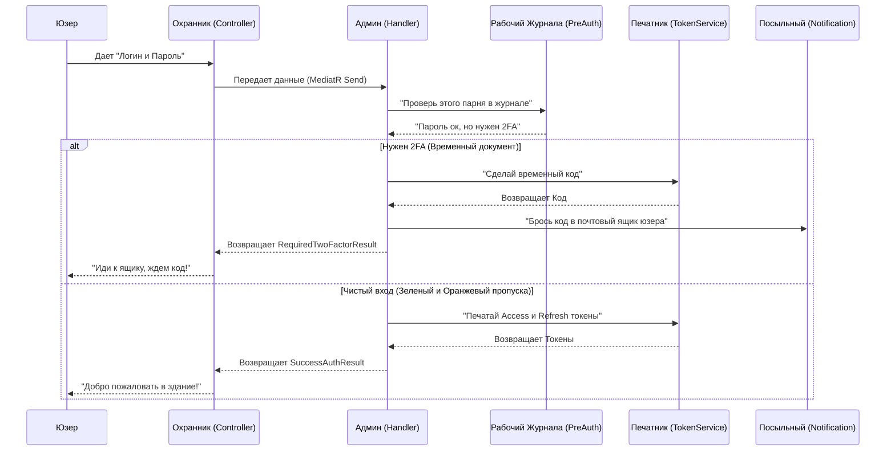
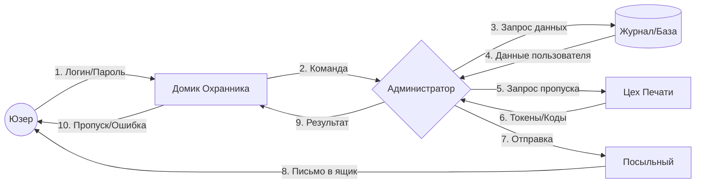

```mermaid
sequenceDiagram
    participant U as Юзер
    participant C as Охранник (Controller)
    participant H as Админ (Handler)
    participant DB as Рабочий Журнала (PreAuth)
    participant TS as Печатник (TokenService)
    participant NS as Посыльный (Notification)

    U->>C: Дает "Логин и Пароль"
    C->>H: Передает данные (MediatR Send)
    
    H->>DB: "Проверь этого парня в журнале"
    DB-->>H: "Пароль ок, но нужен 2FA"

    alt Нужен 2FA (Временный документ)
        H->>TS: "Сделай временный код"
        TS-->>H: Возвращает Код
        H->>NS: "Брось код в почтовый ящик юзера"
        H-->>C: Возвращает RequiredTwoFactorResult
        C-->>U: "Иди к ящику, ждем код!"
    else Чистый вход (Зеленый и Оранжевый пропуска)
        H->>TS: "Печатай Access и Refresh токены"
        TS-->>H: Возвращает Токены
        H-->>C: Возвращает SuccessAuthResult
        C-->>U: "Добро пожаловать в здание!"
    end

```
классы:

* FlowChart : 

```mermaid
graph LR
    User((Юзер)) -- "1. Логин/Пароль" --> Controller[Домик Охранника]
    Controller -- "2. Команда" --> Handler{Администратор}
    
    Handler -- "3. Запрос данных" --> DB[(Журнал/База)]
    DB -- "4. Данные пользователя" --> Handler
    
    Handler -- "5. Запрос пропуска" --> TokenService[Цех Печати]
    TokenService -- "6. Токены/Коды" --> Handler
    
    Handler -- "7. Отправка" --> Notif[Посыльный]
    Notif -- "8. Письмо в ящик" --> User
    
    Handler -- "9. Результат" --> Controller
    Controller -- "10. Пропуск/Ошибка" --> User
```